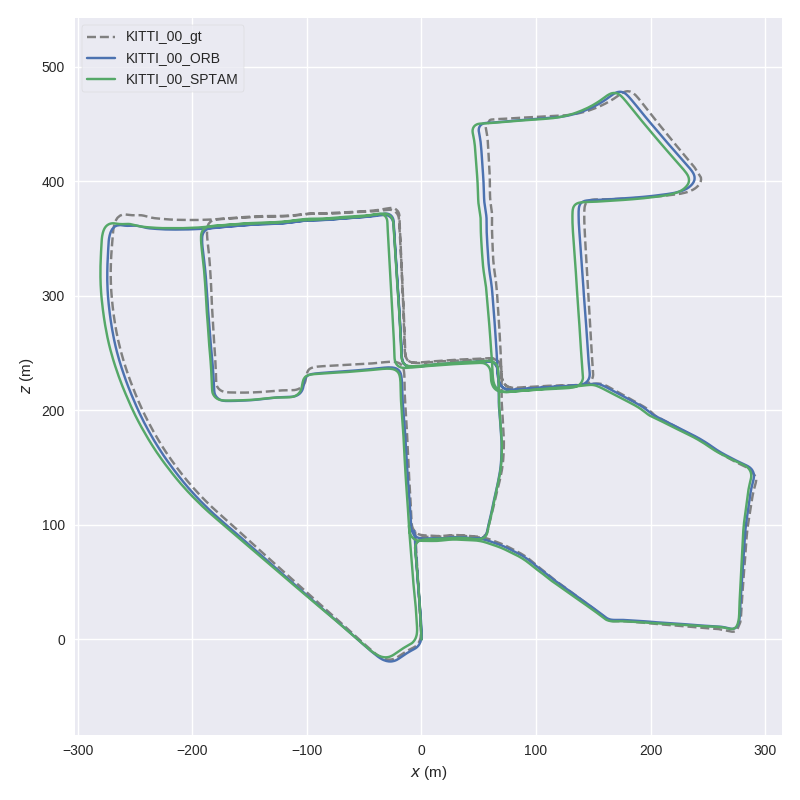
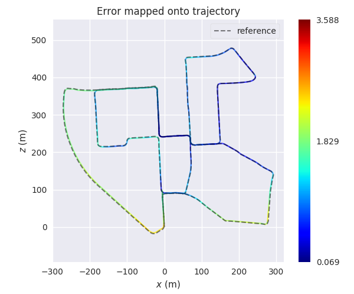
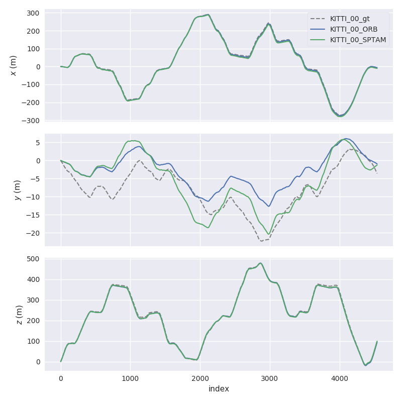
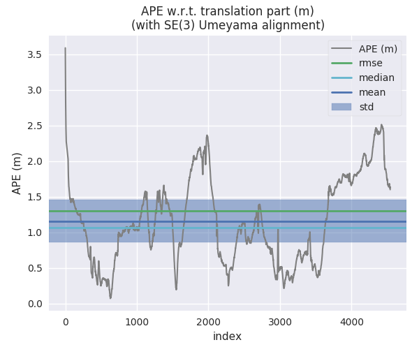
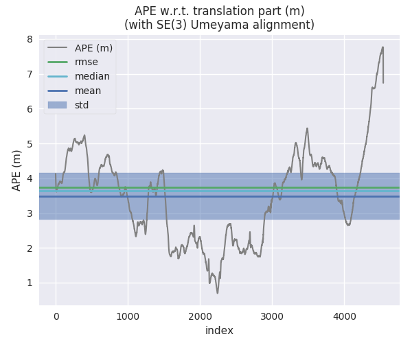
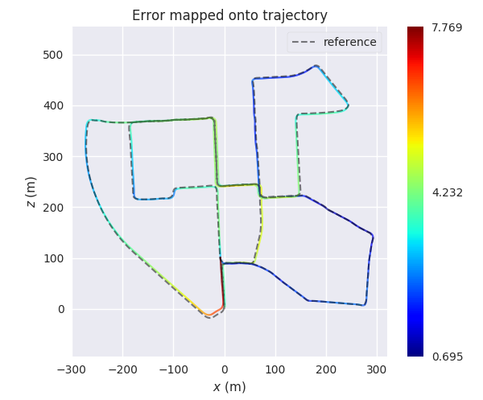
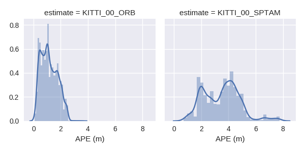
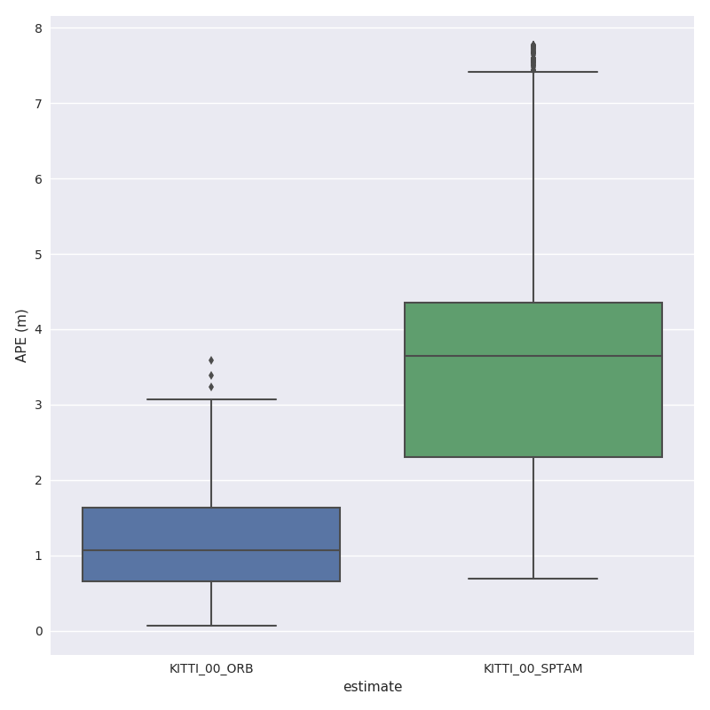

# evo 

***Python package for the evaluation of odometry and SLAM***

| Linux / macOS / Windows / ROS |
| :---: |
| [](https://dev.azure.com/michl2222/michl2222/_build/latest?definitionId=1&branchName=master) |

This package provides executables and a small library for handling, evaluating and comparing the trajectory output of odometry and SLAM algorithms.

Supported trajectory formats:

* 'TUM' trajectory files
* 'KITTI' pose files
* 'EuRoC MAV' (.csv groundtruth and TUM trajectory file)
* ROS bagfile with `geometry_msgs/PoseStamped`, `geometry_msgs/TransformStamped`, `geometry_msgs/PoseWithCovarianceStamped` or `nav_msgs/Odometry` topics

See [here](https://github.com/MichaelGrupp/evo/wiki/Formats) for more infos about the formats.

<!---

-->
<center>
<a href="doc/assets/ape_demo_ORB_map.png" target="_blank"></a>
<a href="doc/assets/res_violin.png" target="_blank"></a>
<a href="doc/assets/res_stats.png" target="_blank"></a>
</center>

---

## Why?

evo has several advantages over other public benchmarking tools:

* common tools for different formats
* algorithmic options for association, alignment, scale adjustment for monocular SLAM etc.
* flexible options for output, [plotting](https://github.com/MichaelGrupp/evo/wiki/Plotting) or export (e.g. LaTeX plots or Excel tables)
* a powerful, configurable CLI that can cover many use cases
* modular `core` and `tools` libraries for custom extensions
* faster than other established Python-based tools ([see here](doc/performance.md))

**What it's not:** a 1-to-1 re-implementation of a particular evaluation protocol tailored to a specific dataset. 

---

## Installation / Upgrade

Installation is easy-peasy if you're familiar with this: https://xkcd.com/1987/#

**Python 3.4+** and **Python 2.7** are both supported. If you want to use the ROS bagfile interface, first check which Python version is used by your ROS installation and install accordingly.
You might also want to use a [virtual environment](doc/install_in_virtualenv.md).

### From PyPi
If you just want to use the executables of the latest release version, the easiest way is to run:
```bash
pip install evo --upgrade --no-binary evo
```
This will download the package and its dependencies from PyPi and install or upgrade them. Depending on your OS, you might be able to use `pip2` or `pip3` to specify the Python version you want. Tab completion for Bash terminals is supported via the [argcomplete](https://github.com/kislyuk/argcomplete/) package on most UNIX systems - open a new shell after the installation to use it (without `--no-binary evo` the tab completion might not be installed properly). If you want, you can subscribe to new releases via https://libraries.io/pypi/evo.

### From Source
Run this in the repository's base folder:
```bash
pip install . --upgrade --no-binary evo
```

### Dependencies

**Python packages**

evo has the following dependencies that are ***automatically resolved*** during installation:

*numpy, matplotlib, scipy, pandas, seaborn, natsort, argcomplete, colorama, pygments, enum34 (only Python 2.7)*

**PyQt5 / PyQt4 (optional)**

PyQt5 will give you the enhanced GUI for plot figures from the "*Qt5Agg*" matplotlib backend (otherwise: "*TkAgg*"). If PyQt5 is already installed when installing this package, it will be used as a default (see `evo_config show`). To change the plot backend afterwards, run `evo_config set plot_backend Qt5Agg`. PyQt4 can be set equivalently.

**ROS (optional)**

All ROS-related features like reading bagfiles require a ROS installation, see [here](http://www.ros.org/). We tested this package with ROS Melodic, Kinetic and Indigo.

---

## Command Line Interface

After installation with setup.py or from pip, the following executables can be called globally from your command-line:

**Metrics:**

* `evo_ape` - absolute pose error
* `evo_rpe` - relative pose error

**Tools:**

* `evo_traj` - tool for analyzing, plotting or exporting one or more trajectories
* `evo_res` - tool for comparing one or multiple result files from `evo_ape` or `evo_rpe`
* `evo_fig` - (experimental) tool for re-opening serialized plots (saved with `--serialize_plot`)
* `evo_config` - tool for global settings and config file manipulation

Call the commands with `--help` to see the options, e.g. `evo_ape --help`. Tab-completion of command line parameters is available on UNIX-like systems.

**More documentation**
Check out the [Wiki on GitHub](https://github.com/MichaelGrupp/evo/wiki).

---

## Example Workflow

There are some example trajectories in the source folder in `test/data`.


1. ***Plot multiple trajectories***

  Here, we plot two KITTI pose files and the ground truth using `evo_traj`:
  ```
  cd test/data
  evo_traj kitti KITTI_00_ORB.txt KITTI_00_SPTAM.txt --ref=KITTI_00_gt.txt -p --plot_mode=xz
  ```

  <center>
  <a href="doc/assets/traj_demo.png" target="_blank"></a>
  <a href="doc/assets/traj_demo_xyz.png" target="_blank"></a>
  </center>

2. ***Run a metric on trajectories***

  For example, here we calculate the absolute pose error for two trajectories from ORB-SLAM and S-PTAM using `evo_ape` (`KITTI_00_gt.txt` is the reference (ground truth)) and plot and save the individual results to .zip files for `evo_res`:

  *First trajectory (ORB Stereo):*

  ```
  mkdir results
  evo_ape kitti KITTI_00_gt.txt KITTI_00_ORB.txt -va --plot --plot_mode xz --save_results results/ORB.zip
  ```

  <center>
  <a href="doc/assets/ape_demo_ORB_raw.png" target="_blank"></a>
  <a href="doc/assets/ape_demo_ORB_map.png" target="_blank"></a>
  </center>

  *Second trajectory (S-PTAM):*
  
  ```
  evo_ape kitti KITTI_00_gt.txt KITTI_00_SPTAM.txt -va --plot --plot_mode xz --save_results results/SPTAM.zip
  ```

  <center>
  <a href="doc/assets/ape_demo_S-PTAM_raw.png" target="_blank"></a>
  <a href="doc/assets/ape_demo_S-PTAM_map.png" target="_blank"></a>
  </center>


3. ***Process multiple results from a metric***

  `evo_res` can be used to compare multiple result files from the metrics, i.e.:
  * print infos and statistics (default)
  * plot the results
  * save the statistics in a table

  Here, we use the results from above to generate a plot and a table:
  ```
  evo_res results/*.zip -p --save_table results/table.csv
  ```

  <center>
  <a href="doc/assets/res_raw.png" target="_blank"></a>
  <a href="doc/assets/res_dist.png" target="_blank"> </a>
  <a href="doc/assets/res_stats.png" target="_blank"></a>
  <a href="doc/assets/res_box.png" target="_blank"></a>
  <a href="doc/assets/res_violin.png" target="_blank"></a>
  </center>

---

## IPython / Jupyter Resources

For an interactive source code documentation, open the [Jupyter notebook](http://jupyter.readthedocs.io/en/latest/install.html) `metrics_tutorial.ipynb` in the `notebooks` folder of the repository. More infos on Jupyter notebooks: see [here](doc/jupyter_notebook.md)

If you have IPython installed, you can launch an IPython shell with a custom evo profile with the command `evo_ipython`.

---

## Contributing Utilities

A few "inoffical" scripts for special use-cases are collected  in the `contrib/` directory of the repository. They are inofficial in the sense that they don't ship with the package distribution and thus aren't regularly tested in continuous integration.

---

## Trouble
*":scream:, this piece of :shit: software doesn't do what I want!!1!1!!"*

**First aid:**
* append `-h`/ `--help` to your command
* check the [Wiki](https://github.com/MichaelGrupp/evo/wiki)
* check the [previous issues](https://github.com/MichaelGrupp/evo/issues?q=is%3Aissue+is%3Aclosed)
* open a [new issue](https://github.com/MichaelGrupp/evo/issues)

**Jupyter notebook errors**

`No module named 'evo'`

This can be caused if the Kernel version of Jupyter does not match the Python version of the evo installation.

---

## Contributing

Patches are welcome, preferably as pull requests.

## License

[GPL-3.0 or later](https://www.gnu.org/licenses/gpl-3.0.html)

If you use this package for your research, a footnote with the link to this repository is appreciated: `github.com/MichaelGrupp/evo`.

...or, for citation with BibTeX:
```
@misc{grupp2017evo,
  title={evo: Python package for the evaluation of odometry and SLAM.},
  author={Grupp, Michael},
  howpublished={\url{https://github.com/MichaelGrupp/evo}}",
  year={2017}
}
```
